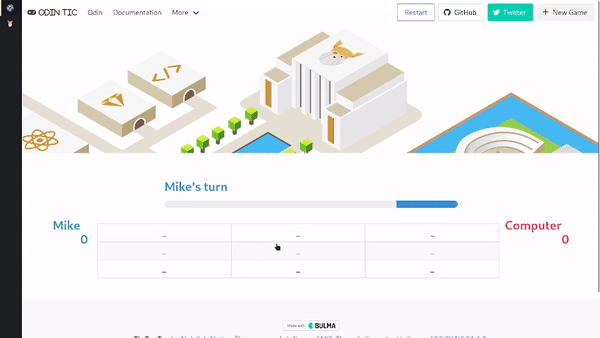
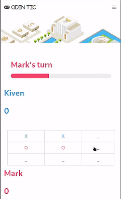
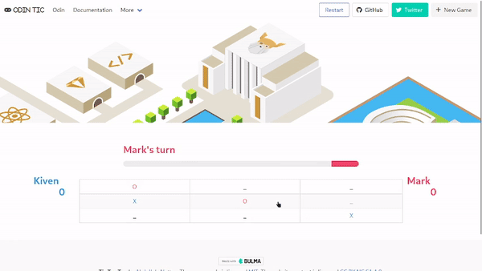

<h1>Tic Tac Toe</h1>

This is a simple implementation of the classic game Tic Tac Toe. It is part of the curriculum for The Odin Project's
  JavaScript course.

<h2>Demo</h2>

You can play the game online <a href="https://i4pg.github.io/tic-tac-toe/" target="_new">here</a>.

<h2>Features</h2>
<ul>
  <li>Two players can play the game (X and O).</li>
  <li>Players can take turns marking spaces on a 3x3 grid.</li>
  <li>The game ends when a player gets three in a row or all spaces are filled without a winner.</li>
  <li>The winner is displayed at the end of the game.</li>
  <li>The game keeps running and calculating points.</li>
  <li>It supports single player so you can play against a computer.</li>
  <li>The computer uses a simple algorithm that takes all the available moves, then loops twice. First, it tries each
    move and plays it if it's a winning move; otherwise, it goes to the next move. Second, if there is no winning move,
    it tries each possible move and plays there if it's preventing the opponent from winning; otherwise, it chooses a
    random place to play.</li>
  <li>It has a mobile-first responsive design, using <a href="https://bulma.io/" target="_new">Bulma.io</a>.</li>
</ul>
<h2>Showcase</h2>

Here are some screenshots of the Tic Tac Toe game:

<h2>Getting Started</h2>
<h3>Usage</h3>

You can play the game online <a href="https://i4pg.github.io/tic-tac-toe/" target="_new">here</a>.

<h3>Installation</h3>

To run this program locally, you can clone the repository to your local machine using the following command:

<pre>
  

    

      bash<button class="flex ml-auto gap-2"><svg stroke="currentColor" fill="none" stroke-width="2"
          viewBox="0 0 24 24" stroke-linecap="round" stroke-linejoin="round" class="h-4 w-4" height="1em" width="1em"
          xmlns="http://www.w3.org/2000/svg" style="--darkreader-inline-stroke: currentColor;"
          data-darkreader-inline-stroke="">
          <path d="M16 4h2a2 2 0 0 1 2 2v14a2 2 0 0 1-2 2H6a2 2 0 0 1-2-2V6a2 2 0 0 1 2-2h2"></path>
          <rect x="8" y="2" width="8" height="4" rx="1" ry="1"></rect>
        </svg>Copy code</button>
    

    
<code class="!whitespace-pre hljs language-bash">git clone https://github.com/i4pg/tic-tac-toe.git
      </code>

  

</pre>

Then open the <code>index.html</code> file in your web browser to start playing the game.

<h2>Contributing</h2>

Contributions to this project are welcome. To contribute, follow these steps:

<ol>
  <li>
    
Fork this repository.

  </li>
  <li>
    
Create a new branch with your changes:

    <pre>
      

        

          javascript<button class="flex ml-auto gap-2"><svg stroke="currentColor" fill="none"
              stroke-width="2" viewBox="0 0 24 24" stroke-linecap="round" stroke-linejoin="round" class="h-4 w-4"
              height="1em" width="1em" xmlns="http://www.w3.org/2000/svg"
              style="--darkreader-inline-stroke: currentColor;" data-darkreader-inline-stroke="">
              <path d="M16 4h2a2 2 0 0 1 2 2v14a2 2 0 0 1-2 2H6a2 2 0 0 1-2-2V6a2 2 0 0 1 2-2h2"></path>
              <rect x="8" y="2" width="8" height="4" rx="1" ry="1"></rect>
            </svg>Copy code</button>
        

        
<code class="!whitespace-pre hljs language-javascript">git checkout -b my-new-branch
          </code>

      

    </pre>
  </li>
  <li>
    
Make your changes and commit them:

    <pre>
      

        

          sql<button class="flex ml-auto gap-2"><svg stroke="currentColor" fill="none" stroke-width="2"
              viewBox="0 0 24 24" stroke-linecap="round" stroke-linejoin="round" class="h-4 w-4" height="1em"
              width="1em" xmlns="http://www.w3.org/2000/svg" style="--darkreader-inline-stroke: currentColor;"
              data-darkreader-inline-stroke="">
              <path d="M16 4h2a2 2 0 0 1 2 2v14a2 2 0 0 1-2 2H6a2 2 0 0 1-2-2V6a2 2 0 0 1 2-2h2"></path>
              <rect x="8" y="2" width="8" height="4" rx="1" ry="1"></rect>
            </svg>Copy code</button>
        

        
<code class="!whitespace-pre hljs language-sql">git commit -am 'Add
              some feature'
          </code>

      

    </pre>
  </li>
  <li>
    
Push your changes to your forked repository:

    <pre>
      

        

          perl<button class="flex ml-auto gap-2"><svg stroke="currentColor" fill="none" stroke-width="2"
              viewBox="0 0 24 24" stroke-linecap="round" stroke-linejoin="round" class="h-4 w-4" height="1em"
              width="1em" xmlns="http://www.w3.org/2000/svg" style="--darkreader-inline-stroke: currentColor;"
              data-darkreader-inline-stroke="">
              <path d="M16 4h2a2 2 0 0 1 2 2v14a2 2 0 0 1-2 2H6a2 2 0 0 1-2-2V6a2 2 0 0 1 2-2h2"></path>
              <rect x="8" y="2" width="8" height="4" rx="1" ry="1"></rect>
            </svg>Copy code</button>
        

        
<code class="!whitespace-pre hljs language-perl">git push origin my-new-branch
          </code>

      

    </pre>
  </li>
  <li>
    
Create a pull request on this repository.

  </li>
</ol>
<h2>License</h2>

This project is licensed under the MIT License. See the <a href="LICENSE" target="_new">LICENSE</a> file for details.

# Tic Tac Toe

This is a simple implementation of the classic game Tic Tac Toe. It is part of the curriculum for The Odin Project's
JavaScript course.

## Demo

You can play the game online []here.
Features

Two players can play the game (X and O).
Players can take turns marking spaces on a 3x3 grid.
The game ends when a player gets three in a row or all spaces are filled without a winner.
The winner is displayed at the end of the game.
The game keeps running and calculating points.
It supports single player so you can play against a computer.
The computer uses a simple algorithm that takes all the available moves, then loops twice. First, it tries each move and
plays it if it's a winning move; otherwise, it goes to the next move. Second, if there is no winning move, it tries each
possible move and plays there if it's preventing the opponent from winning; otherwise, it chooses a random place to
play.
It has a mobile-first responsive design, using Bulma.io.

Showcase

Here are some screenshots of the Tic Tac Toe game:

Getting Started
Usage

You can play the game online here.
Installation

To run this program locally, you can clone the repository to your local machine using the following command:

bash

git clone https://github.com/i4pg/tic-tac-toe.git

Then open the index.html file in your web browser to start playing the game.
Contributing

Contributions to this project are welcome. To contribute, follow these steps:

Fork this repository.

Create a new branch with your changes:

javascript

git checkout -b my-new-branch

Make your changes and commit them:

sql

git commit -am 'Add some feature'

Push your changes to your forked repository:

perl

git push origin my-new-branch

Create a pull request on this repository.

License

This project is licensed under the MIT License. See the LICENSE file for details.
