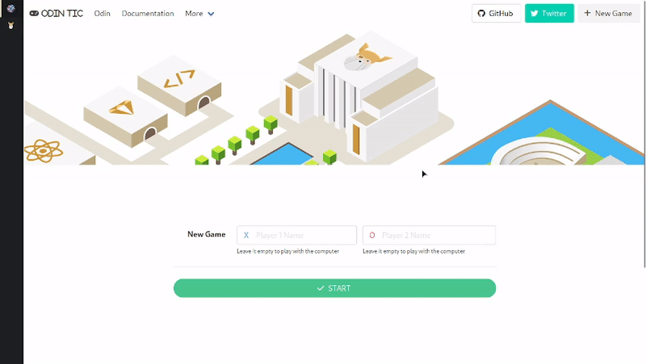
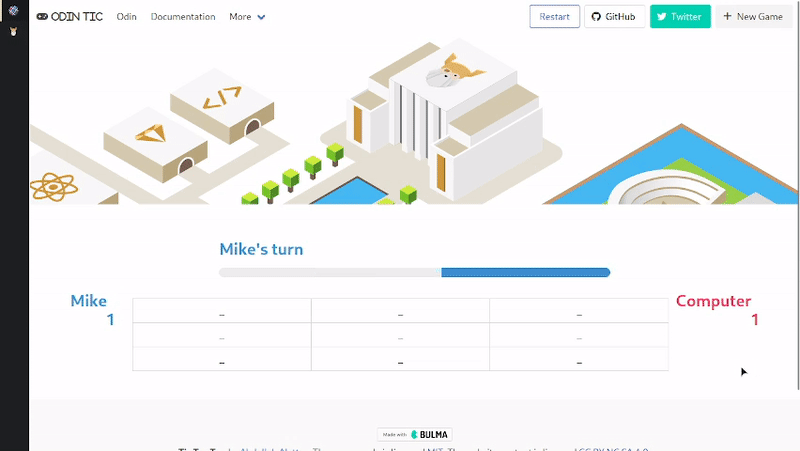

<h1>Tic Tac Toe</h1>

This is a simple implementation of the classic game Tic Tac Toe. It is part of the curriculum for The Odin Project's
  JavaScript course.

<h2>Demo</h2>

You can play the game online <a href="https://i4pg.github.io/tic-tac-toe/" target="_new">here</a>.

<h2>Features</h2>
<ul>
  <li>Two players can play the game (X and O).</li>
  <li>Players can take turns marking spaces on a 3x3 grid.</li>
  <li>The game ends when a player gets three in a row or all spaces are filled without a winner.</li>
  <li>The winner is displayed at the end of the game.</li>
  <li>The game keeps running and calculating points.</li>
  <li>It supports single player so you can play against a computer.</li>
  <li>The computer uses a simple algorithm that takes all the available moves, then loops twice. First, it tries each
    move and plays it if it's a winning move; otherwise, it goes to the next move. Second, if there is no winning move,
    it tries each possible move and plays there if it's preventing the opponent from winning; otherwise, it chooses a
    random place to play.</li>
  <li>It has a mobile-first responsive design, using <a href="https://bulma.io/" target="_new">Bulma.io</a>.</li>
</ul>
<h2>Showcase</h2>

Here are some screenshots of the Tic Tac Toe game:

<h2>Getting Started</h2>
<h3>Usage</h3>

You can play the game online <a href="https://i4pg.github.io/tic-tac-toe/" target="_new">here</a>.

<h3>Installation</h3>

To run this program locally, you can clone the repository to your local machine using the following command:

<code>git clone https://github.com/i4pg/tic-tac-toe.git</code>

Then open the <code>index.html</code> file in your web browser to start playing the game.

<h2>Contributing</h2>

Contributions to this project are welcome. To contribute, follow these steps:

<ol>
  <li>
    
Fork this repository.

  </li>
  <li>
    
Create a new branch with your changes:

    <code>git checkout -b my-new-branch</code>
  </li>
  <li>
    
Make your changes and commit them:

    <code>git commit -am 'Add some feature'</code>
  </li>
  <li>
    
Push your changes to your forked repository:

    <code>git push origin my-new-branch</code>
  </li>
  <li>
    
Create a pull request on this repository.

  </li>
</ol>
<h2>License</h2>

This project is licensed under the MIT License. See the <a href="LICENSE" target="_new">LICENSE</a> file for details.

